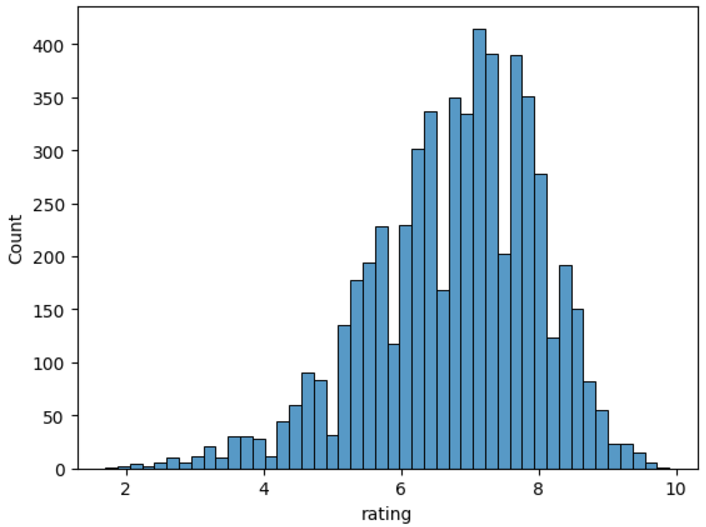

# Movie Recommender System🍿

## ✨ Project Overview
- Topik Rekomendasi : Rekomendasi Film
- Jenis Model Development : Content-Based Filtering

## ✨ Latar Belakang

Dengan semakin populernya platform streaming Netflix, jumlah film yang tersedia bagi penonton semakin meningkat pesat. Hal ini membuat sulit bagi pengguna untuk menemukan film yang sesuai dengan selera mereka di tengah begitu banyak pilihan. 

Project kali ini bertujuan untuk membangun sebuah sistem rekomendasi film berbasis content-based filtering yang dapat memberikan saran film yang relevan kepada pengguna berdasarkan informasi konten film, seperti genre dan rating film. Sistem ini diharapkan dapat membantu pengguna menemukan film baru yang mereka sukai dan meningkatkan pengalaman menonton mereka.

## ✨ Business Understanding

### **Problem Statement**
1. Pengguna dihadapkan pada pilihan film yang sangat luas di Netflix, sehingga sulit bagi mereka untuk menemukan film yang sesuai dengan preferensi mereka.
2. Sistem rekomendasi yang ada saat ini mungkin tidak cukup personal, sehingga seringkali memberikan saran film yang tidak relevan dengan minat pengguna

### **Goals**
1. Memberikan rekomendasi film yang relevan dan akurat sehingga pengguna dapat menemukan film yang mereka sukai dengan lebih mudah.
2. Memberikan rekomendasi buku yang mungkin disukai pengguna.

### **Solution Approach**

1. Membuat model sistem rekomendasi
2. Menggunakan informasi konten film seperti genre, kata kunci dalam sinopsis untuk memberikan rekomendasi.
3. Menyesuaikan rekomendasi berdasarkan preferensi pengguna yang lebih spesifik yaitu fitur genre.

## ✨ Data Understanding

### **Informasi Dataset**
- Dataset yang digunakan berasal dari [Kaggle - Netflix Popular Movies Dataset](https://www.kaggle.com/datasets/narayan63/netflix-popular-movies-dataset/data).

### **Struktur Dataset**
Dataset terdiri dari 9 kolom dengan deskripsi sebagai berikut:

| No  | Kolom         | Tipe Data  | Deskripsi                                                                 |
| --- | ------------- | ---------- | ------------------------------------------------------------------------- |
| 1   | `title`       | object     | Judul dari film.                                                         |
| 2   | `year`        | object     | Tahun rilis film.                                                        |
| 3   | `certificate` | object     | Sertifikat rating usia, seperti "PG-13", "R", dll.                       |
| 4   | `duration`    | object     | Durasi film dalam format waktu, misalnya "2h 30m".                       |
| 5   | `genre`       | object     | Genre film, misalnya "Action", "Comedy", dll.                            |
| 6   | `rating`      | float64    | Rating film berdasarkan skor pengguna.                                   |
| 7   | `description` | object     | Deskripsi singkat tentang cerita film.                                   |
| 8   | `stars`       | object     | Nama-nama bintang yang membintangi film.                                 |
| 9   | `votes`       | object     | Jumlah suara (votes) yang diberikan oleh pengguna untuk film tersebut.   |

### **Kondisi Dataset**
#### Jumlah Data
- Jumlah Baris (Data Film): 9.957
- Jumlah Kolom (Fitur): 9
- Missing Value: pada kolom year sebanyak 527, 
kolom certificate sebanyak 3.453, 
kolom duration sebanyak 2.036, 
kolom genre sebanyak 73,
kolom rating sebanyak 1.173, dan 
kolom votes sebanyak 1.173. 

- Penanganan missing value pada kolom year, certificate, duration, genre, rating, dan votes dihapus untuk memastikan kualitas data.

### **EDA (Exploratory Data Analysis)**

-  Bagaimana distribusi film berdasarkan tahun rilis?

- Bagaimana tren peningkatan/penurunan jumlah film yang dirilis setiap tahunnya?

- Film apa saja dengan rating tertinggi tiap tahunnya?

- Film apa saja dengan votes terbanyak setiap tahunnya?

- Bagaimana distribusi rating film?

- Genre apa yang paling disukai?

---

## ✨ Data Preparation

Pada tahap ini, saya melakukan step by step untuk eksplorasi data, diantaranya:

1. Mengubah Tipe data
Dapat dilihat pada kolom data diatas, kolom `year` masih bertipe data object, kolom `duration` masih bertipe data object, dan kolom `votes` juga masih bertipe data object. Oleh karena itu 
kita akan mengubah tipe datanya.

- untuk kolom `year` : Terlihat data tanggal yang bervariasi dengan beberapa pola diantaranya, (YYYY): Hanya tahun, (YYYY– ): Tahun mulai hingga sekarang,
(YYYY–YYYY): Tahun mulai hingga tahun berakhir,(II) (YYYY): Tahun dengan penanda tambahan (II),(YYYY–2022): Tahun mulai hingga 2022. 

Berikut hasil setelah tipe data diubah menjadi `datetime` dan dirapikan

- untuk kolom `duration`: Terlihat pola yang tidak rapi dan tipe datanya masih string, maka dari itu kita akan lakukan perbaikan.
Berikut hasil setelah tipe data diubah menjadi `datetime` dan dirapikan

- untuk kolom `votes`: Kita akan mengubah tipe datanya menjadi int, berikut sample hasil setelah tipe data diubah.

- Selanjutnya, kita akan mengecek kembali semua tipe data yang berhasil diubah:

2. Mengatasi Missing Value (Karena terdapat banyak missing value pada data yaitu pada kolom `year` sebanyak 527, kolom `certificate` sebanyak 3453, kolom duration sebanyak 2036, kolom `genre` = 73, kolom `rating` 1173 dan kolom `votes`= 1173, maka dari itu kita membersihkannya dengan menghapusnya)
3. Mengecek nilai unik setiap kolom
4. Melakukan ekstraksi list untuk kolom genre, dan 
5. Melakukan Transformasi untuk Variabel Numerik

 

6. Melihat nilai unik pada kolom genre. Berikut sample outputnya :

7. Mengonversi data yang akan menjadi fitur utama dengan `tolist()`, yaitu untuk kolm `genre`, `title`, dan `rating`
8. Membuat dictionary pada data dengan memanfaatkan 3 fitur utama yaitu `tittle`, `genre`, dan `rating`
9. Melakukan **TF-IDF Vectorization**: Mengubah teks genre menjadi representasi numerik berbasis bobot.1. Menggabungkan genre menjadi string untuk setiap film, menginisialisasi **`TfidfVectorizer`** dari `sklearn` dan melakukan transformasi teks genre menjadi matriks TF-IDF.

10. Menghitung cosine similarity pada matriks TF-IDF.

11. Mengonversi hasil TF-IDF menjadi DataFrame untuk memudahkan pencarian

## ✨ Model Development dengan Content-Based Filtering

Langkah-langkah yang dilakukan:
- **Cosine Similarity**:
   - Menghitung skor kesamaan antar film menggunakan **Cosine Similarity** pada matriks TF-IDF.
   - Nilai kesamaan berkisar dari 0 (tidak mirip) hingga 1 (identik).

- **Rekomendasi Top-N**:
   - Berdasarkan skor kesamaan, sistem menghasilkan daftar film yang paling mirip dengan film pilihan pengguna.

#### **Output**:
Berikut adalah sample rekomendasi untuk film **"Legally High"**:
| **Judul**                               | **Genre**      | **Rating** |
|------------------------------------------|----------------|------------|
| League of Legends Origins                | Documentary    | 6.50       |
| Last Breath                              | Documentary    | 7.70       |
| How to Change Your Mind                  | Documentary    | 7.90       |
| Pandemic: How to Prevent an Outbreak     | Documentary    | 6.40       |
| Chelsea Does                             | Documentary    | 7.30       |
| The Director: An Evolution in Three Acts | Documentary    | 6.20       |
| Our Great National Parks                 | Documentary    | 7.90       |
| The Blue Planet                          | Documentary    | 8.10       |
| The Blue Planet                          | Documentary    | 8.60       |
| The Blue Planet                          | Documentary    | 8.10       |

#### **Kelebihan**:
- Rekomendasi sangat relevan karena berbasis kesamaan genre.
- Mudah diterapkan dengan komputasi yang efisien.

#### **Kekurangan**:
- Kurangnya keberagaman dalam rekomendasi (contoh: duplikasi output untuk film "The Blue Planet").
- Tidak mempertimbangkan atribut tambahan seperti rating atau ulasan pengguna.

---

## ✨ Evaluasi Model
### **Metrik yang Digunakan**

1. **Precision@K**:
   - Mengukur proporsi item relevan dalam daftar rekomendasi teratas (Top-K).
   - Rumusnya adalah:
   Precision@K = (Jumlah Rekomendasi Relevan) / (Total Rekomendasi)
   - Pada output di atas, semua rekomendasi memiliki genre yang sama (**Documentary**), sehingga Precision@10 adalah **1.0**.

2. **Coverage**:
   - Menghitung proporsi item unik yang direkomendasikan di seluruh query pengguna.
   - Pada kasus ini, nilai coverage menurun karena adanya entri duplikat seperti **"The Blue Planet"**.

## ✨ Hasil Evaluasi

- **Relevansi**: Semua film yang direkomendasikan memiliki genre yang sama, menunjukkan relevansi tinggi untuk pencarian berbasis genre.
- **Keberagaman**: Output kurang beragam karena adanya entri duplikat seperti **"The Blue Planet"** yang muncul beberapa kali.
- **Precision@K**: Skor sempurna sebesar **1.0**, menandakan bahwa semua rekomendasi relevan berdasarkan genre.

